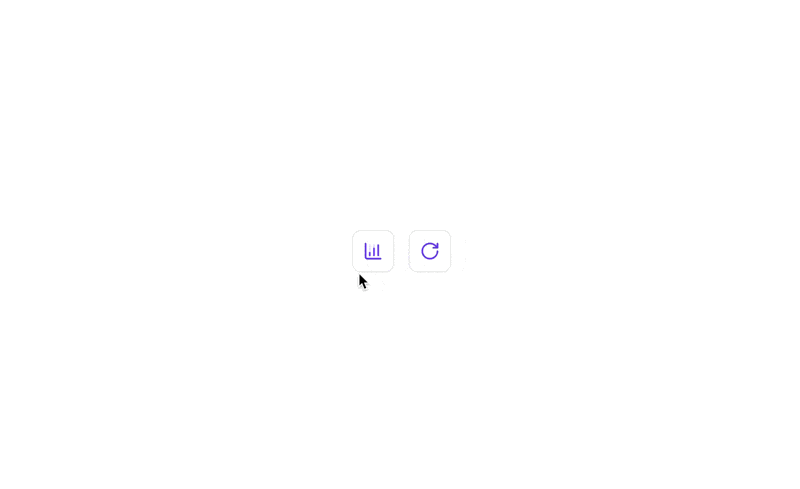
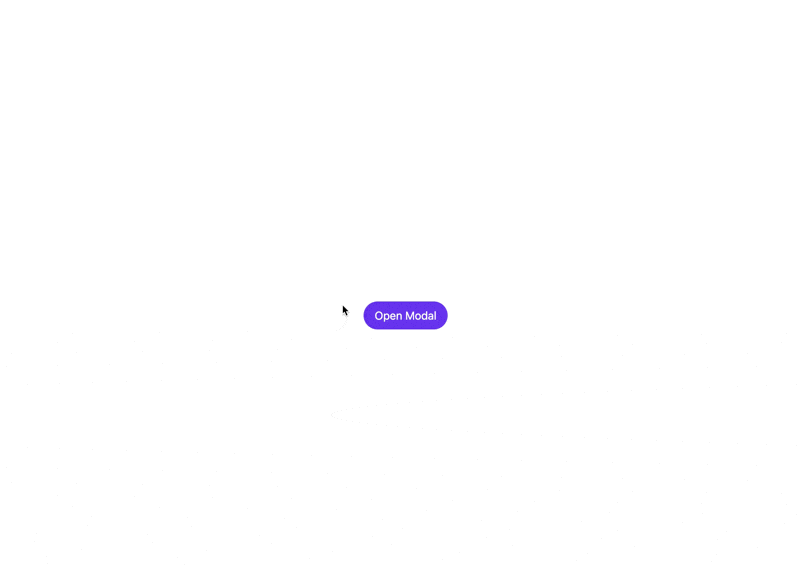

# Prototype to improve Evervault DX

I've used `framer-motion` for the animations.

## Logs animated icons

It's included two animated icons for the Evervault Logs page.

## Create function modal

- Improved use of shadow.
- Animated the check icon when a item is selected.
- Fixed the glitch when an item is selected.

